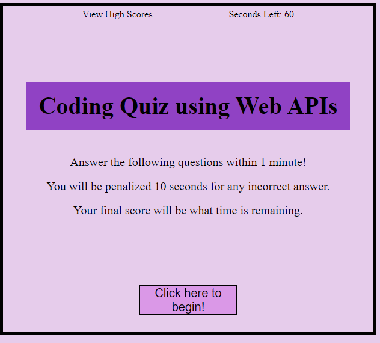

# Code-Quiz
This quiz tests your knowledge of javascript essentials!

This application was created with vanilla JavaScript, using only the essentials we learned about Web APIs. It features a timer which subtracts 10 seconds for every incorrect answer. The final score is the time left. The scores are meant to be stored into local storage so that users can keep track of all high scores but I ran out of time this week and could not finish this aspect of the quiz - I will add it later!

## Features
This quiz utilizes functions, for-loops, arrays, objects, targeting IDs to hide or display sections of HTML using the JavaScript - basically every single thing I've learned about JavaScript so far! Many students collaborated for this assignment as it was particularly challenging and I saw many use an array for each question but I decided to go with 1 array for all questions and creating key-value pairs to call upon later in the function used to check answers. I found this shortened the code substantially. 

## Issues
There are still a number of issues to figure out with this application. One I already mentioned, the high scores. The other is the timer generating the score, as well as the timer running out generating a score of 0. These are all issues I plan to come back to later to use as a learning tool.